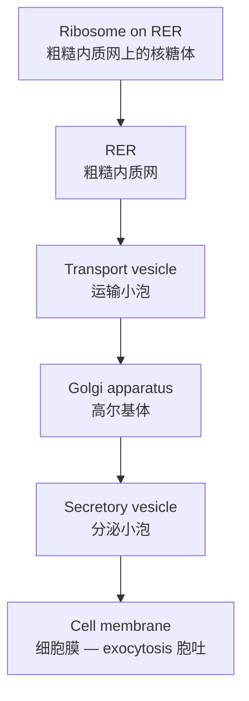

# 1.1 Cell Structure 细胞结构

The cell is the basic unit of life. All living things are made of one or more cells.

## Prokaryotic vs eukaryotic cells

| Feature | {{Prokaryotic cell|原核细胞}} | {{Eukaryotic cell|真核细胞}} |
|---|---|---|
| Nucleus | No true nucleus — DNA lies free in the cytoplasm | DNA enclosed in a nucleus with a nuclear envelope |
| DNA | Circular, no histones; may have plasmids | Linear, wound around histones (chromosomes) |
| Membrane-bound organelles | None | Present (mitochondria, ER, Golgi…) |
| Ribosomes | Smaller (70S) | Larger (80S) in cytoplasm |
| Size | About 1–5 µm | About 10–100 µm |
| Examples | Bacteria | Animals, plants, fungi, protists |

## Organelles and their functions

| Organelle | Function |
|---|---|
| {{Nucleus|细胞核}} | Contains DNA; controls cell activities; the nucleolus makes ribosomes |
| {{Cell membrane|细胞膜}} | Partially permeable; controls what enters and leaves the cell |
| {{Cytoplasm|细胞质}} | Site of many chemical reactions |
| {{Mitochondrion|线粒体}} | Site of aerobic respiration — releases energy as ATP |
| {{Ribosome|核糖体}} | Site of protein synthesis |
| {{Rough endoplasmic reticulum|粗糙内质网}} | Covered in ribosomes; transports proteins |
| {{Smooth endoplasmic reticulum|光滑内质网}} | Makes lipids and steroids; detoxification |
| {{Golgi apparatus|高尔基体}} | Modifies, packages and sorts proteins into vesicles |
| {{Lysosome|溶酶体}} | Contains hydrolytic enzymes; digests worn-out organelles and pathogens |
| {{Chloroplast|叶绿体}} | Site of photosynthesis (plants only) |
| {{Vacuole|液泡}} | Stores cell sap; keeps plant cells turgid |
| {{Cell wall|细胞壁}} | Made of cellulose; gives support and shape (plants) |
| {{Centriole|中心粒}} | Forms spindle fibres in cell division (animals) |

## How a protein is made and secreted

This pathway is a favourite exam question — know the order.

## Plant cell vs animal cell

| | Plant cell | Animal cell |
|---|---|---|
| Cell wall | ✓ cellulose | ✗ |
| Chloroplasts | ✓ | ✗ |
| Vacuole | Large, permanent, central | Small, temporary (if any) |
| Centrioles | ✗ (in most plants) | ✓ |
| Shape | Fixed, regular | Irregular |
| Food store | Starch | Glycogen |

## Magnification

$$\text{Magnification} = \frac{\text{image size}}{\text{actual size}}$$

Remember the units: $1\ \text{mm} = 1000\ \mu\text{m}$ and $1\ \mu\text{m} = 1000\ \text{nm}$. Convert both sizes to the **same unit** before dividing.

> **Exam tip:** "Organelle" questions usually ask for structure **and** function. Always write both, e.g. "Mitochondria — site of aerobic respiration, which releases energy as ATP."
