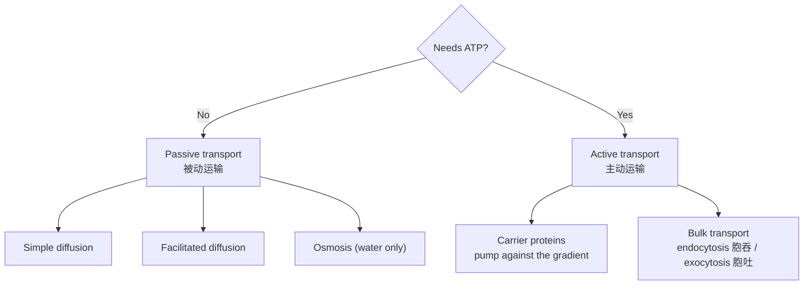

# 1.2 Movement Across Membranes 物质的跨膜运输

## The fluid mosaic model

The cell membrane is described by the {{fluid mosaic model|流动镶嵌模型}}:

- A {{phospholipid bilayer|磷脂双分子层}} — hydrophilic (water-loving) heads face outwards, hydrophobic tails face inwards.
- **Proteins** are scattered in the bilayer like tiles in a mosaic: {{channel proteins|通道蛋白}} and {{carrier proteins|载体蛋白}}.
- **Cholesterol** controls fluidity; **glycoproteins** and glycolipids act in cell recognition.
- "Fluid" because the phospholipids and proteins can move sideways.

The membrane is **partially permeable** — small, non-polar molecules (O₂, CO₂) pass easily; ions and large molecules need proteins.

## The four ways substances move

| Process | Energy (ATP)? | Direction | Proteins needed? | Example |
|---|---|---|---|---|
| {{Diffusion|扩散}} | No | High → low concentration | No | O₂ into cells, CO₂ out |
| {{Facilitated diffusion|协助扩散}} | No | High → low concentration | Channel / carrier | Glucose into red blood cells |
| {{Osmosis|渗透作用}} | No | Water: high → low water potential | Aquaporins (sometimes) | Water into root hair cells |
| {{Active transport|主动运输}} | **Yes** | **Low → high** concentration | Carrier proteins | Mineral ions into root hairs |

## Osmosis in detail

**Osmosis** is the net movement of water molecules from a region of **higher water potential** to a region of **lower water potential** through a partially permeable membrane.

| Solution outside the cell | Animal cell (e.g. red blood cell) | Plant cell |
|---|---|---|
| {{Hypotonic|低渗}} (more dilute) | Gains water → swells and **bursts** (haemolysis) | Gains water → **turgid**; the cell wall stops it bursting |
| {{Isotonic|等渗}} (same) | No net change | No net change (flaccid) |
| {{Hypertonic|高渗}} (more concentrated) | Loses water → **shrinks** (crenation) | Loses water → membrane pulls away from wall: {{plasmolysis|质壁分离}} |

## Factors that affect the rate of diffusion

1. **Concentration gradient** — steeper gradient, faster diffusion.
2. **Surface area** — larger area, faster (e.g. microvilli, alveoli).
3. **Diffusion distance** — thinner membrane, faster.
4. **Temperature** — higher temperature, more kinetic energy, faster.

> **Exam tip:** For active transport always mention **both** "against the concentration gradient" **and** "uses energy from respiration / ATP via carrier proteins".
