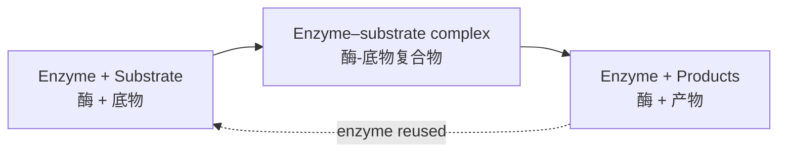

# 2.1 Enzymes 酶

An {{enzyme|酶}} is a biological catalyst — a protein that speeds up a chemical reaction without being used up.

## Properties of enzymes

- Made of **protein** with a specific 3D shape.
- **Specific** — each enzyme catalyses one type of reaction.
- **Not used up** — can be reused many times.
- Work by **lowering the activation energy** of a reaction.
- Affected by **temperature**, **pH**, **substrate concentration** and **enzyme concentration**.

## How enzymes work

The {{substrate|底物}} binds to the {{active site|活性部位}} to form an {{enzyme–substrate complex|酶-底物复合物}}. The products are then released and the enzyme is free to work again.

| Model | Idea |
|---|---|
| {{Lock-and-key model|锁钥模型}} | The active site has a fixed shape that is **complementary** to the substrate, like a key in a lock. |
| {{Induced-fit model|诱导契合模型}} | The active site **changes shape slightly** as the substrate binds, giving a closer fit. This is the modern view. |

## Factors affecting enzyme activity

### Temperature

- Rate increases as temperature rises up to the {{optimum temperature|最适温度}} (about 37 °C for human enzymes): molecules have more kinetic energy, so there are more successful collisions.
- Above the optimum, bonds holding the enzyme's shape break. The active site changes shape and the substrate no longer fits — the enzyme is {{denatured|变性}}. This is **permanent**.
- At low temperature the enzyme is **inactive**, not denatured. Activity returns when it warms up.

### pH

Each enzyme has an **optimum pH** (pepsin ≈ pH 2, amylase ≈ pH 7). Extreme pH changes the charges in the active site, so the substrate can no longer bind — the enzyme denatures.

### Substrate concentration

Rate increases with substrate concentration until all active sites are occupied. The graph then **levels off** — enzyme concentration is now the limiting factor.

## Enzyme inhibitors

| | {{Competitive inhibitor|竞争性抑制剂}} | {{Non-competitive inhibitor|非竞争性抑制剂}} |
|---|---|---|
| Shape | Similar to the substrate | Not similar to the substrate |
| Binds to | The active site | Another site on the enzyme |
| Effect | Blocks the active site | Changes the shape of the active site |
| Adding more substrate | **Reduces** the inhibition | Does **not** reduce the inhibition |

> **Exam tip:** Never write "the enzyme is killed" — enzymes are molecules, not living things. Write "the enzyme is **denatured**; the active site changes shape so the substrate can no longer fit."
